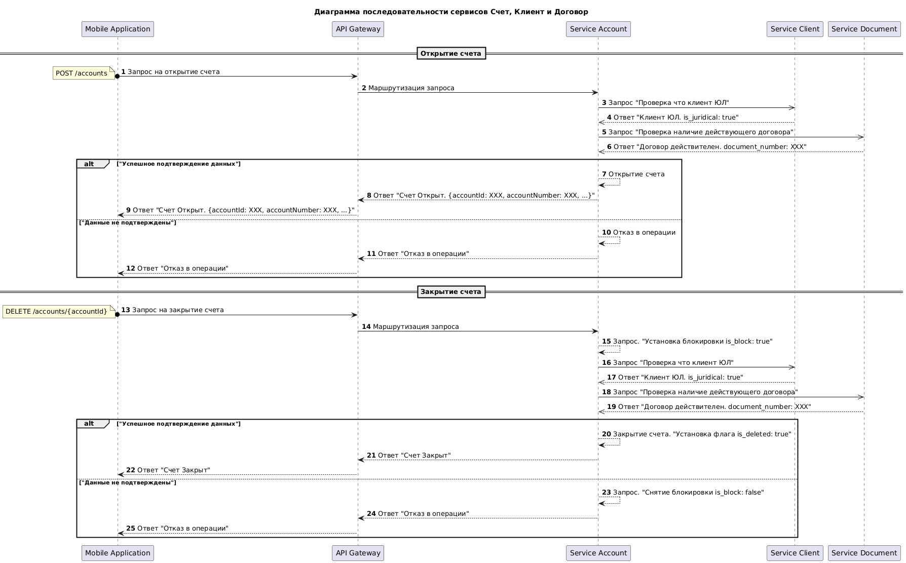
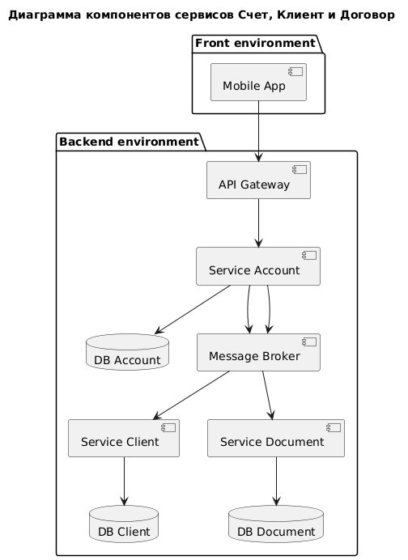
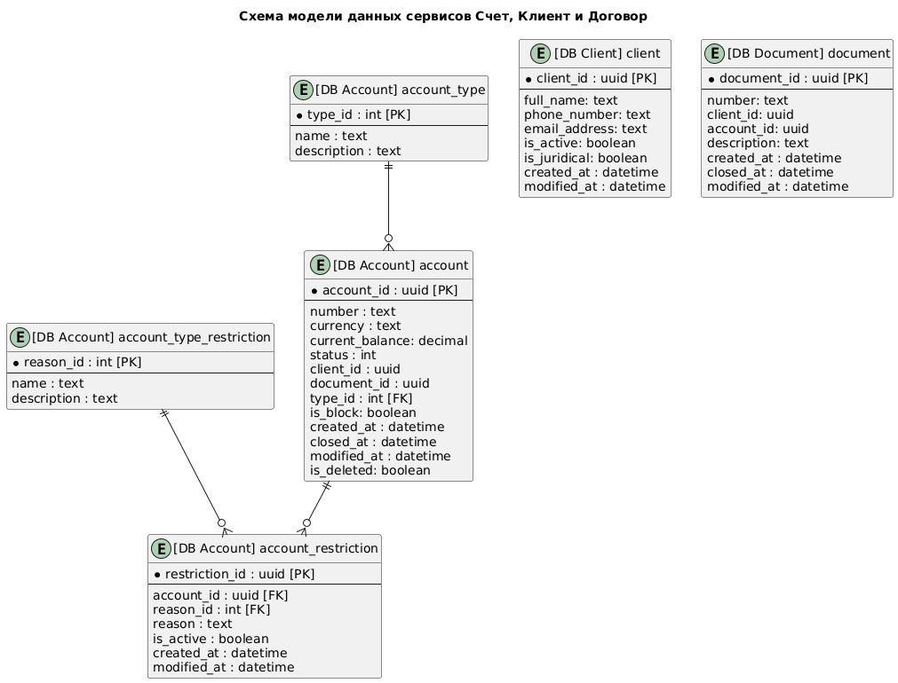

# SRS. Реализация нового функционала "Счета ЮЛ"
## 1. Общие сведения
### 1.1 Цели и задачи выполнения работ
Целью выполнения работ по развитию Системы является расширение ее функциональных возможностей.
Для достижения поставленной цели должно быть обеспечено решение следующих задач:
* В мобильном приложении «Мой Банк» добавить новый раздел "Счета ЮЛ" с
функциональностью, которая позволит пользователю (клиент ЮЛ) управлять своими
счетами в Банке.
* На стороне серверной части для этих целей добавить сервис управления
счетами клиентов - Сервис Счета (Service Account) предназначенный для хранения и обработки данных о счетах клиентов банка. Хранения данных будет организовано в Реляционной базе данных Счета (DB_Account)
### 1.2 Наименование Системы
* Мобильное приложение «Мой Банк»
* Сервис Клиенты (Service Client)
* Реляционная база данных Клиенты (DB_Client)
* Сервис Договора (Service Document)
* Реляционная база данных Клиенты (DB_Document)

### 1.3 Назначение Системы
* Мобильное приложение «Мой Банк» - приложение, которое позволяет клиентам управлять своими финансами онлайн.
* API Gateway - шлюз для обработки входящих запросов от мобильного приложения в Service Account
* Message Broker Nats - брокер сообщения для межпроцессного асинхронного взаймодействия между сервисами
* Service Client - внешний сервис, предназначенный для хранения и обработки данных о клиентах банка.
* Service Document - внешний сервис, предназначенный для хранения и обработки данных о договорах банковского обслуживания, заключенных с клиентами.

## 2. Функции Системы
### 2.1 Функциональные требования:
| Номер | Краткое наименование | Описание |
| ------------- | ------------- | ------------- |
| FR - 1 | Открытие нового счета | Пользователь может инициировать открытие нового счета. Service Account проверяет статус клиента и наличие действующего договора после чего операция завершается |
| FR - 2 | Закрытие существующего счета | Пользователь может инициировать закрытие существующего счета. Service Account устанавливает блокировку на счет, проверяет статус клиента и действующего договора, после чего операция завершается |
| FR - 3 | Установка/снятие блокировки счета | Пользователь может инициировать установку или снятие блокировки на существующий счет |
| FR - 4 | Просмотр списка счетов | Пользователь получает перечень всех открытых и закрытых счетов |
| FR - 5 | Просмотр детальной информации о счете | При выборе конкретного счета пользователю отображается детальная информация |
| FR - 6 | Изменение параметров счета | Пользователь может изменить определенные параметры счета. Service Account проверяет статус клиента и наличие действующего договора после чего операция завершается |

### 2.2 Нефункциональные требования:
| Номер | Краткое наименование | Описание |
| ------------- | ------------- | ------------- |
| NFR - 1 | Производительность | - |
| NFR - 2 | Доступность | Сервис должнен быть доступен 99.9% времени в год |
| NFR - 3 | Надежность | - |
| NFR - 4 | Безопасность | В качестве канала передачи данных использовать HTTPS, для аутентификации/авторизации запросов использовать JWT |
| NFR - 5 | Логирование | Журналирование пользовательских операций (протоколирование пользовательских сессий, операций, результатов, время) |
| NFR - 6 | Масштабируемость | Система должна поддерживать горизонтальное масштабирование сервиса и базы данных |

## 3. Требования к клиентской части
Реализуемый функционал в разделе "Счета ЮЛ" должен позволять:
* Просматривать список всех открытых счетов клиента;
* Просматривать детальную информацию о счете;
* Вносить изменения в данные открытого счета;
* Открывать новый счет;
* Закрывать существующий счет.

### User Story:
| Номер | Описание | Критерии приемки |
| ------------- | ------------- | ------------- |
| US-1 | Как клиент ЮЛ, я хочу открыть новый счет, чтобы использовать его для расчетов | 
1. Система проверяет, что клиент существует и имеет действующий договор 2. После успешной проверки открывается новый счет |
| US-2 | Как клиент ЮЛ, я хочу закрыть неиспользуемый счёт, чтобы больше им не пользоваться | 
1. Перед закрытием счёт блокируется 2. Проводятся проверки клиента и договора 3. В случае успеха счёт закрывается |

### Use Case 1:
| | |
| ------------- | ------------- |
| ИД и название | UC-1. Открытие нового счета |
| Краткое описание | У пользователя должна быть возможность в мобильном приложении открыть новый счет в разделе "Счет ЮЛ" |
| Действующие лица | Пользователь банка, мобильное приложение банка, Service Account |
| Триггер | - |
| Предусловие | Пользователь авторизовался в приложении |
| Постусловие | Новый счет открыт |
| Основной поток: | 
1. Пользователь переходит в раздел "Счет ЮЛ" 2. Пользователь нажимает на "Открыть счет" 3. Система проверяет: - является ли пользователь клиентом в Service Client - есть ли действующий договор в Service Document 4. Система создает новый счет и сохраняет в БД 5. Система отображет нотификацию "Открыт новый счет" |
| Альтернативный поток 1 | 
Пользователь перешел в раздел "Счет ЮЛ", но не нажал "Открыть счет": 1. Пользователь переходит в раздел "Счет ЮЛ" 2. Пользователь не нажимает на "Открыть счет" 3. Система не создает новый счет  |
| Альтернативный поток 2 | 
Пользователь перешел в раздел "Счет ЮЛ", нажал "Открыть счет" и закрыл приложение 1. Пользователь переходит в раздел "Счет ЮЛ" 2. Пользователь нажимает на "Открыть счет" 3. Пользователь закрывает приложение 4. Выполняется основной поток с 3 пункта |
| Потом исключения | При недоступности сервисов отобразить ошибки и предложение повторить операцию позже |

### Use Case 2:
| | |
| ------------- | ------------- |
| ИД и название | UC-2. Закрытие существующего счета |
| Краткое описание | У пользователя должна быть возможность в мобильном приложении закрыть существующий счет в разделе "Счет ЮЛ" |
| Действующие лица | Пользователь банка, мобильное приложение банка, Service Account |
| Триггер | - |
| Предусловие | Пользователь авторизовался в приложении |
| Постусловие | Выбранный счет закрыт |
| Основной поток: | 
1. Пользователь переходит в раздел "Счет ЮЛ" 2. Пользователь выбирает счет и нажимает на "Закрыть счет" 3. Система блокирует счет (is_block: true) 4. Система проверяет: - является ли пользователь клиентом Service Client - есть ли действующий договор Service Document 5. Система помечает счет в БД как удаленный (is_deleted: true) 6. Система отображет нотификацию "Счет закрыт" |
| Альтернативный поток | 
Пользовватель не прошел проверку в МС Клиенты или МС Договора 1. Система снимает блокировку со счета (is_block: false) 2. Система отображет нотификацию "Ошибка закрытия счета" |
| Потом исключения | При недоступности сервисов отобразить ошибки и предложение повторить операцию позже |

## 4. Требования к серверной части
Service Account должен поддерживать выполнение следующих операций:
* Возврат данных по счетам
* Открытие счета
* Закрытие счета
* Внесение изменений в параметры счета
* Установка и снятие блокировок на счет

Диаграмма последовательности отображает операцию Открытие и Закрытие счета.
[Ссылка на исходники](https://gclnk.com/Np5DyIwx)

Диаграмма компонентов верхнеуровнево отображает архитектуру системы 
[Ссылка на исходники](https://gclnk.com/6p45fVNs)

Описанная спецификация REST API Service Account [Swagger](spec-service-account.yaml)

## 5. Требование к данным
В DB_Account необходимо будет добавить следующие сущности:
* account (счета)
* account_type (тип счета)
* account_restriction (ограничения)
* account_type_restriction (тип ограничения)

### 5.1 Модель данных
В данной ER диаграмме отображены таблицы в DB_Account, кроме этого отображены таблицы в DB_Client и DB_Document. [Ссылка на исходники](https://gclnk.com/QbMip6gK)

### 5.2 Описание таблиц DB_Account

### account - хранит данные о счетах клиентов (ЮЛ)
    Primary key - account_id
    Foreign key - type_id ссылка на account_type

| Имя поля       | Тип данных | Описание поля               | NULL | UNIQUE | CHECK             | DEFAULT        |
|----------------|------------|------------------------------|------|--------|-------------------|----------------|
| account_id [PK]      | UUID       | Уникальный ID счета         | ❌   | ✅     | —                 | —              |
| number         | TEXT       | Номер счета                 | ❌   | ✅     | —                 | —              |
| currency       | TEXT       | Валюта счета                | ❌   | ❌     | —                 | —              |
| current_balance| DECIMAL    | Текущий баланс              | ❌   | ❌     | —                 | —           |
| status         | INT        | Статус (0 – active, 1 – closed, ...)| ❌ | ❌     | —                | —              |
| client_id      | UUID       | ID клиента                  | ❌   | ❌     | —                 | —              |
| document_id    | UUID       | ID договора                 | ❌   | ❌     | —                 | —              |
| type_id [FK]        | INT        | Тип счета                   | ❌   | ❌     | —                 | —              |
| is_block       | BOOLEAN    | Признак блокировки          | ❌   | ❌     | —                 | —          |
| created_at     | DATETIME   | Дата создания               | ❌   | ❌     | —                 | now()          |
| closed_at      | DATETIME   | Дата закрытия               | ✅   | ❌     | —                 | —              |
| modified_at    | DATETIME   | Последнее изменение         | ✅   | ❌     | —                 | —              |
| is_deleted     | BOOLEAN    | Флаг удаления счета         | ❌   | ❌     | —                 | —          |

---

### account_type - тип счета
    Primary key - type_id

| Имя поля   | Тип данных | Описание поля        | NULL | UNIQUE | CHECK | DEFAULT |
|------------|------------|----------------------|------|--------|--------|---------|
| type_id [PK]   | INT        | ID типа              | ❌   | ❌     | —      | —       |
| name       | TEXT       | Название типа        | ❌   | ❌     | —      | —       |
| description| TEXT       | Описание типа        | ✅   | ❌     | —      | —       |

---

### account_restriction - хранит данные об операциях над счетами (ДТ и КТ)
    Primary key - restriction_id
    Foreign key - account_id ссылка на account
    Foreign key - reason_id ссылка на account_type_restriction

| Имя поля       | Тип данных | Описание поля                    | NULL | UNIQUE | CHECK | DEFAULT |
|----------------|------------|----------------------------------|------|--------|--------|---------|
| restriction_id [PK] | UUID       | ID ограничения                   | ❌   | ✅     | —      | —       |
| account_id     [FK] | UUID       | ID счета                         | ❌   | ❌     | —      | —       |
| reason_id      [FK] | INT        | Причина ограничения              | ❌   | ❌     | —      | —       |
| reason         | TEXT       | Описание причины         | ✅   | ❌     | —      | —       |
| is_active      | BOOLEAN    | Признак актуальности             | ❌   | ❌     | —      | —    |
| created_at     | DATETIME   | Дата создания записи             | ❌   | ❌     | —      | now()   |
| modified_at    | DATETIME   | Последнее обновление             | ✅   | ❌     | —      | —       |

---

### account_type_restriction - тип ограничения
    Primary key - reason_id

| Имя поля   | Тип данных | Описание поля              | NULL | UNIQUE | CHECK | DEFAULT |
|------------|------------|----------------------------|------|--------|--------|---------|
| reason_id [PK]  | INT        | ID причины ограничения     | ❌   | ❌     | —      | —       |
| name       | TEXT       | Название причины           | ❌   | ❌     | —      | —       |
| description| TEXT       | Подробное описание         | ✅   | ❌     | —      | —       |

---

### 6. ПМИ
todo

## Доп. задание
### Расширение архитектуры

В архитектуру системы добавлены следующие компоненты:
* API Gateway - единая точка входящих запросов от клиентов 
с маршрутизацией трафика в сервисы
* Message Broker Nats - брокер сообщений использующийся для ассинхронного обмена сообщениями в формате JSON между сервисами по принципу pub/sub
* Redis - база данных типа key value, использующийся для кэширования данных на стороне каждого сервиса

### SLA
todo

### Отказоустойчивость
todo

### Быстродействие
Можно использовать некоторые практики для повышения произовдительности обработки запросов:
- Горизонтально масштабировать Service Account расположив его за балансировщиком нагрузки для равномерного распределения нагрузки между экземплярами сервиса
- Горзионтально масштабировать DB_Account, разграничить запросы на запись и чтение из разных источников, для этого можно использовать классический паттерн master-slave, в master будет происходить запись, далее данные будут реплицироваться в slave для последующего чтения
- Шардировать или партицировать большие таблицы в DB_Account
- Оптимизация на уровне SQL запросов
- Использовать кэширование данных в Redis
